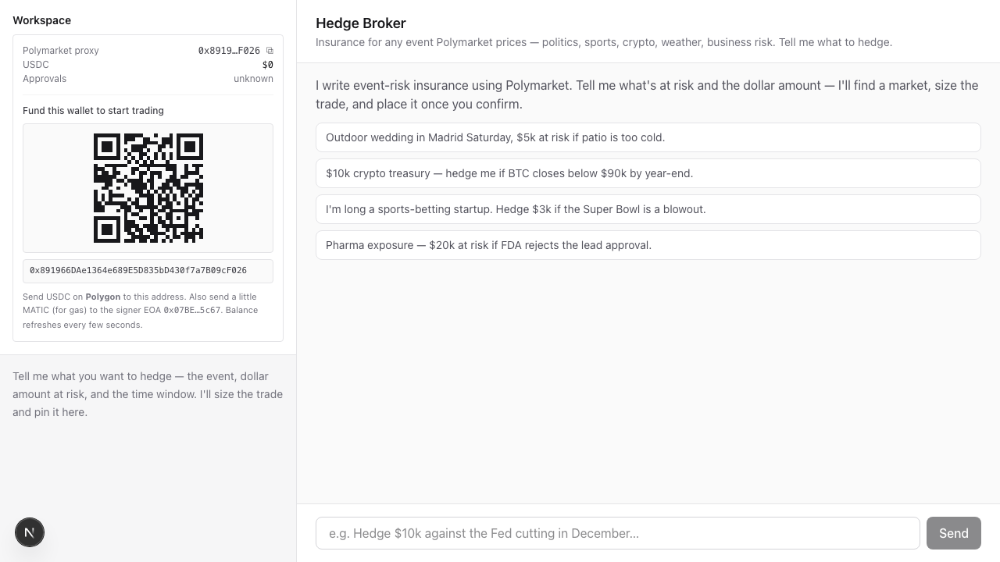
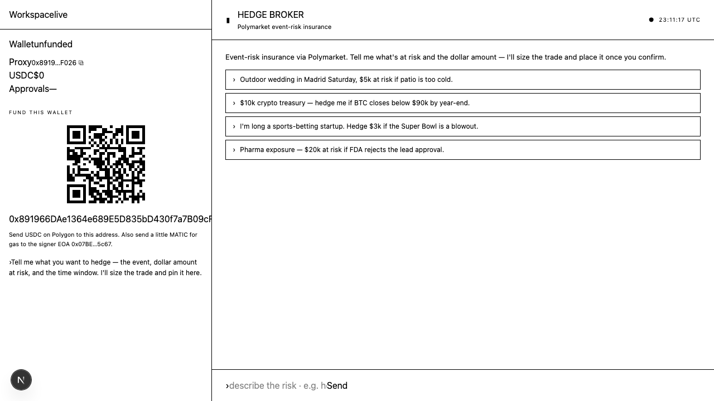

# Hedge Broker

A chat-driven **event-risk insurance broker** that hedges any insurable event by buying YES/NO shares on [Polymarket](https://polymarket.com) prediction markets — and can place the trade for you through a connected wallet.

Tell it what you're trying to protect against. It finds the right market, sizes the position against your dollar exposure, and pins a quote on the workspace. Confirm in chat and it places the order through the Polymarket CLI.

Two surfaces:

- **`@weather/web`** — Next.js chat UI with streaming tool calls, wallet panel, and a pinned active-trade card.
- **`@weather/cli`** — `weather` command for browsing / quoting Polymarket weather markets from the terminal.

Both share a single domain core (`@weather/core`).

## Design

The chat UI is built off **Variant A** from the design shotgun — a terminal aesthetic (IBM Plex Mono, dark panels, amber accents, a workspace rail with wallet + active-trade card on the left, conversation stream on the right).

**Design mock — Variant A**



Source HTML for the mock: [`docs/design/variant-A.html`](docs/design/variant-A.html).

**Implemented**



The shipped UI keeps the layout and tokens from the mock and adds: streaming tool-call indicators, suggested-reply pills under the composer, an auto-created wallet with funding QR, and a light-theme toggle.

## What it covers

The broker is wired to Polymarket-wide search, not just weather. Categories it routes:

- **Weather** — city-level temperature (NYC, Tokyo, Madrid, Beijing, Shanghai, Singapore, Jakarta, Bangkok, Hong Kong, London, Seoul, Paris…), seasonal hurricanes / tornadoes, space weather.
- **Politics & elections, geopolitics, sports, crypto / macro, business (M&A, FDA, earnings), entertainment.**

If no Polymarket market exists for the risk, the broker says so plainly instead of fabricating one.

## Architecture

```
weather-cli/
├── packages/core/        # @weather/core — shared domain logic
│   ├── polymarket.ts     # search/get/list — wraps the `polymarket` CLI binary
│   ├── weather.ts        # category + city classification, weather-relevant filter
│   ├── hedge.ts          # computeHedge / quoteFromMarket — sizing + ROI math
│   └── trading.ts        # wallet status, approvals, market orders, positions
├── apps/cli/             # @weather/cli — `weather` Commander CLI
│   └── src/index.ts      # list / city / cities / show / quote / hedge
└── apps/web/             # @weather/web — Next.js 16 chat broker
    ├── app/api/chat/     # streaming chat route (DeepSeek + AI SDK tools)
    ├── app/api/wallet/   # wallet status / create / approvals endpoints
    ├── lib/tools.ts      # broker tools exposed to the model
    ├── lib/system-prompt.ts
    └── components/       # Chat, WalletPanel, Workspace
```

The broker exposes these tools to the model: `search_weather_markets`, `list_cities`, `search_markets`, `get_market`, `compute_hedge_quote`, `wallet_status`, `setup_wallet`, `run_approvals`, `place_order`, `get_positions`, `suggest_replies`.

## Running it

Requirements: **Node 22+**, **pnpm 10**, and the [`polymarket` CLI](https://github.com/Polymarket) on `$PATH` (or `POLYMARKET_BIN` set).

```bash
pnpm install
pnpm build

# Chat broker (http://localhost:3000)
pnpm web

# Terminal CLI
pnpm cli list
pnpm cli city Tokyo
pnpm cli quote <slug> --side yes --budget 300 --exposure 10000
```

`apps/web/.env.local` needs `DEEPSEEK_API_KEY` (the chat route uses `@ai-sdk/deepseek`).

## Trading flow

Trades cost real USDC. The broker walks the user through it:

1. `wallet_status` — if not configured, `setup_wallet` creates one and shows a funding QR.
2. User sends USDC + a little MATIC (gas) to the proxy address on Polygon.
3. `run_approvals` — one-time on-chain approvals so the CLOB can move USDC.
4. Broker reads back the trade summary one more time, asks **"Place it?"**.
5. Only after explicit confirmation: `place_order` with the right `clobTokenIds[]` and amount.
6. On fill, surfaces orderId + filled amount and offers `get_positions` to verify.

It will never claim an order placed unless `place_order` returned an `orderId`.

## Stack

- **Runtime** — Node 22, ESM, TypeScript 6
- **Web** — Next.js 16, React 19, Tailwind 4, AI SDK 6, DeepSeek (`@ai-sdk/deepseek`), `qrcode.react`, `react-markdown`
- **CLI** — Commander 14
- **Core** — Zod 4 for parsing, `execa` to drive the `polymarket` binary
- **Workspace** — pnpm workspaces (`apps/*`, `packages/*`)
